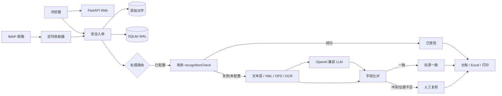

# 架构与数据流

## 设计目标

1. 单机 Docker 部署足够简单，同时保留未来拆分任务队列和数据库的边界。
2. 原始发票不可被识别或排版流程改写。
3. 每个结论能回答“来自哪条证据路径”，不混淆官方查验与模型一致性。
4. 邮箱/API 密钥不以明文写入数据库和日志。
5. 普通成员的数据访问、去重和查验缓存均包含所有者边界，管理员保留全局运维能力。

## 组件

## 运行模型

- 一个 Uvicorn 进程提供页面和 API。
- APScheduler 在同一进程中按间隔触发邮箱扫描，`max_instances=1` 防止同一任务重叠。
- 上传后使用受限后台处理槽处理票据；邮件任务同步处理已导入票据。每用户和全局并发、每日上传/OCR/LLM 次数及存储量均有上限。
- SQLite 使用 WAL、外键和 30 秒 busy timeout。

因此当前 Compose 必须保持一个应用副本。扩展为多副本时，应先把任务改为 Redis/Celery 或等价队列，并迁移 PostgreSQL。

## 数据模型

- `users`：本地/OIDC 身份和角色。
- `invoices`：所有者、文件指纹、来源、状态、规范化字段、OCR/LLM/税务原始结果、冲突和重复关系；文件指纹和业务重复按所有者查询。
- `mailboxes`：所有者、IMAP 参数、加密授权码、UID 游标和最近错误。
- `processed_emails`：`mailbox_id + uid` 唯一，保证同一邮件不重复消费。
- `app_settings` / `user_integration_settings`：全局和用户级集成配置；密钥字段使用 Fernet 加密。非空环境变量优先于数据库值。
- `verification_caches`：包含所有者及完整发票指纹的当日税务查验缓存，禁止跨用户或仅凭票号复用。
- `audit_logs`：用户发起的安全/业务操作，管理员可全局审计。
- `job_logs`：后台任务运行摘要，普通成员只读取自己的任务。

## 身份与租户边界

- 本地账号使用邮箱和 Argon2 密码；公开注册默认至少 12 位且包含字母和数字。
- OIDC 身份以 `issuer + sub` 为稳定主键。只有明确 `email_verified=true` 的邮箱才能存储或参与允许域/冲突判断；同邮箱的本地账号不会自动绑定。
- 请求通过会话获得当前用户。普通成员访问发票、文件、邮箱、任务日志、个人集成、去重和缓存时都附加 `owner_id`；管理员可越过所有者过滤进行全局维护。
- 所有用户仍共享一个进程、SQLite 文件和数据目录。这是应用级行隔离，不是独立数据库、独立密钥或抵抗恶意管理员的安全域；需要强租户隔离时部署独立实例。

## 配置优先级

查验集成的有效值按以下顺序解析：非空环境变量 → 用户自己的数据库配置（适用时）→ 管理员全局数据库配置 → 默认值。环境变量中的密钥不会写入数据库，页面只显示该键由环境提供。空环境变量不覆盖已经保存的有效配置。

## 状态语义

| 状态 | 含义 |
| --- | --- |
| `pending` / `processing` | 已入库或正在处理 |
| `verified` | 税务识别查验接口成功返回 |
| `consistent` | OCR 与 LLM 至少三个共同字段、关键字段无冲突且一致率不低于 75% |
| `review` | 未配置 LLM、证据不足、关键字段冲突或回退失败 |
| `reviewed` | 用户人工确认并保存 |
| `duplicate` | 与已有发票业务键疑似重复 |
| `failed` | 文件解析或处理异常 |

`consistent` 不是发票真伪证明。

## 文件安全

- 只接受 PDF、OFD、XML、PNG、JPG；ZIP 只作为运输容器，限制文件数和展开总体积。
- OFD 内部条目数和总展开体积另行限制，避免将 OFD 当作绕过 ZIP 限额的压缩容器。
- 按文件头和扩展名共同判断格式。
- 文件名只作为展示信息，实际落盘名使用 UUID。
- 邮件链接每次请求和重定向前解析 DNS，阻止私网、回环、链路本地、保留和多播地址，限制响应体大小。
- 用户配置的 IMAP/LLM 目的地址同样经过 DNS/IP 边界校验；私网目标只有管理员显式加入 `OUTBOUND_PRIVATE_HOST_ALLOWLIST` 后才能访问。
- 原文件放在认证路由之后，不把上传目录作为静态目录暴露。

## 进程与 HTTP 边界

- Compose 默认只向 `127.0.0.1` 发布应用端口；跨容器代理必须使用受控共享网络，或配合防火墙显式开放宿主机监听。
- Uvicorn 和应用分别使用 `FORWARDED_ALLOW_IPS`、`TRUSTED_PROXY_IPS` 判断直接代理对端，不信任任意客户端提交的转发头。
- OpenAPI 默认关闭；统一响应中间件发送 CSP、禁止 MIME 嗅探/嵌入、严格 Referrer Policy 等安全头，并对认证、管理、文件和导出响应禁用缓存。
- 容器以非 root 运行，根文件系统只读，仅 `/data` 和受限 `/tmp` 可写；Compose 再施加 capability、PID、CPU、内存和日志上限。

## 税务路由

1. `POST {baseUrl}/api/getAppToken.do`
2. `POST {baseUrl}/api/login.do`，access token 有效期约两小时并在进程内缓存。
3. `POST {baseUrl}/kapi/app/rim/message`，`messageType=recognitionCheck`，文件以 Base64 传输。
4. 成功结果保存原始响应和规范化字段；异常写入任务日志并回退双源流程。

接口依据：[app_token](https://open-ultimate.piaozone.com/api-145421044)、[access_token](https://open-ultimate.piaozone.com/api-145421045)、[发票识别查验](https://open-ultimate.piaozone.com/api-145421073)。
